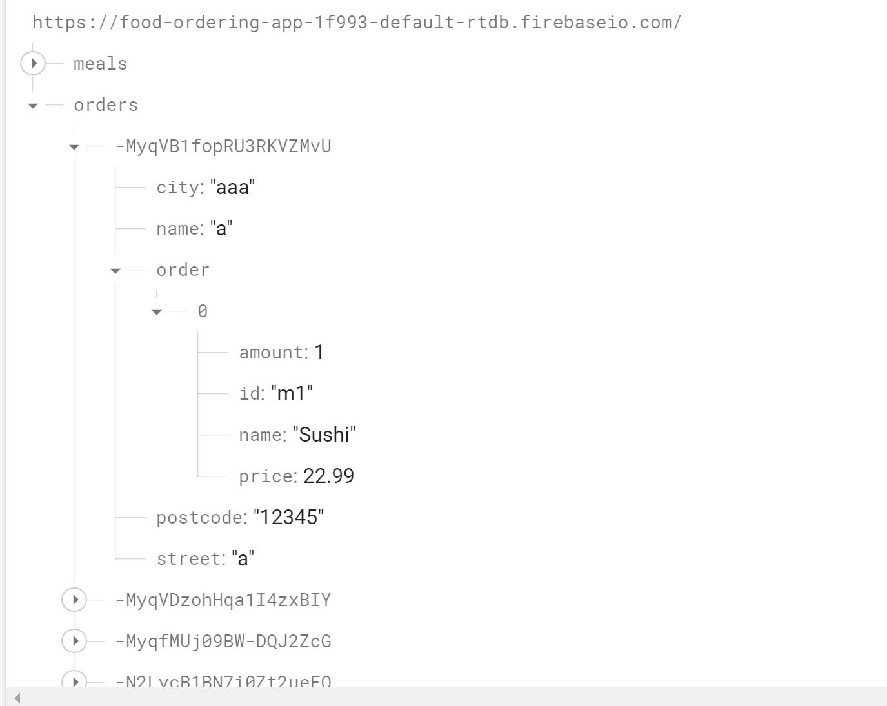

# Food-ordering App

A front end web-app allowing user to order food [Live Link](https://jeffdeng-food-ordering-app.netlify.app)

## Description

This app is built with React using redux for cart state management.

The purpose of this project is to practice and enhance my front-end development skills, especially React and using redux for state management.

## Relevant Techs

### Front-End:

- React
- Redux
- CSS

### Back-End:

- firebase realtime database

## Key Features

- Shopping cart

  

- useFrom Hook for form validation

      ```
        const {register, handleSubmit, formState: { errors }} = useForm({
          mode:'onBlur' //validte value if not on blur
        })
      ```
            <input
              {...register('postcode',{
                                        required:true,
                                        maxLength: 5,
                                        minLength:5,
                                        pattern: /^[0-9]+$/,
                                        validate:input=>!isEmptyInput(input)
                                      })
              }
        type="text" id='postcode'/>

  

- Order stored at firebase realtime database




## Challenges

- The hard part of this project is to figure out the boilerplate of redux and how actions, store, reducers work with each other.
